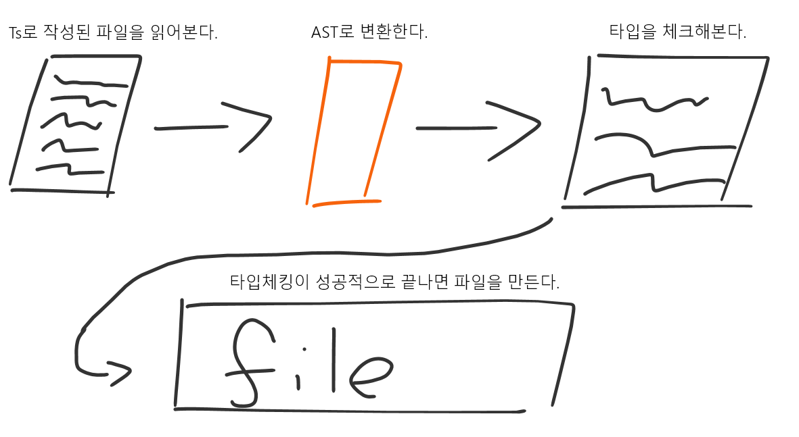

 

Persnal Blog

https://devxion-blog.vercel.app

https://xionwcfm.tistory.com

https://www.youtube.com/@XionCoding

  

  

 
 

---

## TypeScript의 컴파일 과정

 

1. `tsconfig`를 scan한다.
2. 파일의 root부터 시작하여 import로 연결된 모든 파일을 가능한대로 찾는다.
3. `.ts` 확장자로 작성된 파일은 ts 코드가 있을 것을 기대할 수 있다. `.ts` 파일을 AST로 변환한다.
4. AST로 파싱한 코드를 기준으로 해당 트리에 있는 symbol(`const`등)을 identifier로 변경한다.
5. binder와 추상구문트리를 기준으로 타입을 체크한다.
6. AST를 1번에서 읽었던 `tsconfig`의 옵션에 맞게 변경한다.
7. 추상구문트리를 `.js`, `.d.ts`파일 등으로 변경한다

 

## 

---

### Scanner

---

### Parser

---

### Binder

---

### Checker

---

### Emitter

---

 
 

타입스크립트의 컴파일 과정에서 중요한 역할을 맡는 파트들을 5개 정도로 구분한다고 하면

위와 같이 구분할 수 있습니다.

이중 `emitter`가 하는 일이 제법 재미있는데 `emitter`가 하는 일은 크게 다음과 같이 표현할 수 있습니다.

1. `.js` , `.map`, `d.ts` 파일 만들기

2. 추상구문트리를 text로 변환하기

3. 루프 내부의 _i, _i2와 같은 임시변수를 추적하기

4. 추상구문트리를 추상구문트리로 변환하기

추상구문트리를 추상구문트리로 변환한다는 게 의아하게 느껴질 수 있습니다.

이는 타입스크립트 AST를 자바스크립트 AST로 변환하는 일을 말하는데

타입스크립트의 AST에서 타입을 나타내는 Keyword 신택스를 제거하는 과정이라고도 표현할 수 있습니다.

 

이 다섯가지 파트들에 대해 더 자세한 정보를 원한다면 [제 블로그](https://xionwcfm.tistory.com/288)를 방문하세요!

<!--  -->

<!-- 
 -->

